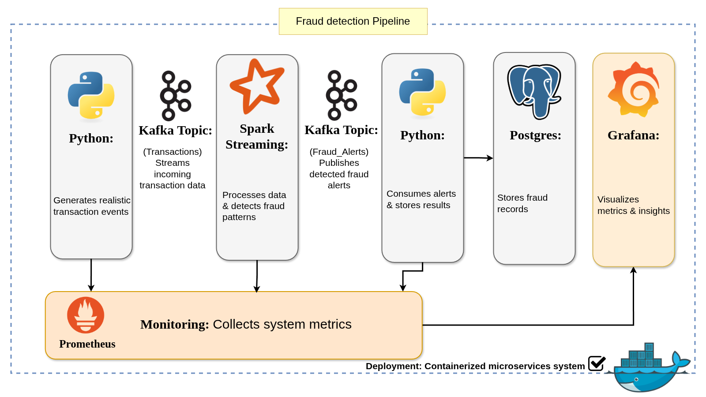

# Real-Time Fraud Detection Pipeline

## Overview

This project is a **real-time streaming fraud detection pipeline** built using Kafka and Apache Spark Structured Streaming. It generates synthetic financial transactions, streams them through Kafka, detects fraudulent behavior in real time, and stores fraud alerts in PostgreSQL. The system also includes monitoring using Prometheus and Grafana.

---

## Project Structure

```
.
├── consumer
│   ├── consumer.py          # Kafka consumer and PostgreSQL storage layer
│   ├── Dockerfile
│   └── requirements.txt
├── producer
│   ├── producer.py          # Fake transaction generator (Kafka producer)
│   ├── Dockerfile
│   └── requirements.txt
├── spark-app
│   ├── fraud_streaming.py   # Spark Structured Streaming fraud detection logic
│   ├── Dockerfile
│   ├── requirements.txt
│   └── utils
├── monitoring
│   └── prometheus.yml       # Prometheus configuration
├── utils
│   └── logger.py            # Centralized logging utility
├── spark-master
│   └── logs
├── docs
│   ├── fraud_detector.drawio.png
│   ├── Grafana_Dashboard.png
│   └── Prometheus.png
├── docker-compose.yml       # Full system orchestration
└── README.md
```

---

## Technologies Used

* Python 3.11+
* Apache Kafka (stream ingestion)
* Apache Spark Structured Streaming (fraud detection engine)
* PostgreSQL (fraud alerts storage)
* Prometheus (metrics collection)
* Grafana (visualization dashboards)
* Faker (synthetic data generation)
* Docker & Docker Compose (containerized infrastructure)

---
## Work Flow

## System Workflow

### 1. Data Generation (Producer)

The producer generates synthetic financial transactions using Faker.

* Simulates normal and fraudulent behavior
* Fraud is injected with ~10% probability
* Sends data to Kafka topic: `transactions`

Fraud patterns include:

* High transaction amounts
* Unusual country changes
* High-risk merchant categories

---

### 2. Streaming Layer (Kafka)

Kafka acts as the real-time message broker between producer and Spark.

* Buffers incoming transaction streams
* Ensures fault tolerance and scalability

---

### 3. Fraud Detection (Spark Streaming)

Spark processes transactions in real time using window-based aggregations.

#### Features computed:

* Transaction count per user
* Number of distinct countries
* Maximum transaction amount

#### Fraud rules:

* High-value transactions (> 3000)
* Location inconsistency (multiple countries)
* High frequency of transactions in a short time window

#### Fraud scoring model:

A weighted scoring system is used:

* High value: 2 points
* Location change: 2 points
* High frequency: 1 point

Only records with score >= 2 are flagged.

Output topic: `fraud_alerts`

---

### 4. Storage Layer (Consumer)

The Kafka consumer:

* Reads fraud alerts from `fraud_alerts`
* Filters confirmed fraud cases
* Stores results in PostgreSQL table `alerts`

Stored fields include:

* user_id
* window time range
* transaction statistics
* fraud flags

---

### 5. Monitoring & Observability

The system exposes metrics via Prometheus exporters:

* Number of messages produced
* Spark batch processing count
* Fraud detections count
* Database errors

Grafana dashboards visualize:

* Fraud detection trends
* System throughput
* Pipeline health

---

## How to Run

### Step 1: Clone the repository

```
git clone <repo-url>
cd fraud_detector
```

---

### Step 2: Start the system

```
docker-compose up -d --build
```

---

### Step 3: Access services

* Kafka: localhost:9092
* Spark Master UI: localhost:8080
* Prometheus: localhost:9090
* Grafana: localhost:3000

---

### Step 4: Grafana login

```
Username: admin
Password: admin
```

---

## Key Features

* Real-time streaming fraud detection
* Scalable Kafka + Spark architecture
* Rule-based fraud scoring system
* PostgreSQL persistence layer
* Full observability with Prometheus and Grafana
* Fault-tolerant consumers with retry logic
* Structured logging system

---

## Metrics Endpoints

* Producer metrics: :8000
* Consumer metrics: :8001
* Spark metrics: :8002

---

## Future Improvements

* Replace rule-based system with ML-based fraud detection
* Use Delta Lake or Iceberg for storage optimization
* Add alerting system (Slack / Email notifications)
* Deploy using Kubernetes for production scaling

---

## Contributions

Contributions are welcome. Feel free to open issues or submit pull requests for improvements or bug fixes.
